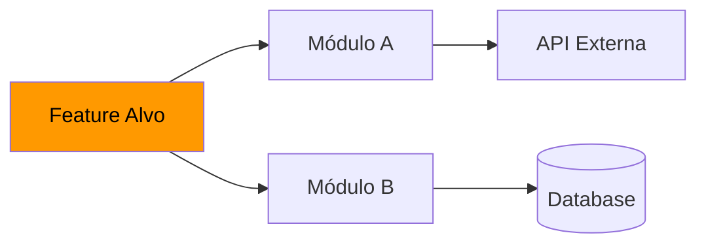

# Fase 1 — RESEARCH: Elicitação e Contexto

> **Owner:** Tech Lead / Engenheiro Sênior responsável pela feature
> **Comando:** `/ngsdd:research`
> **Opcional no Quick Path** — Obrigatória no Full Path.

---

## Objetivo

Eliminar zonas cinzentas, "context debt" e ambiguidades **antes** de qualquer especificação.
O Research garante que a spec que será escrita reflete a realidade do sistema, não suposições.

---

## Quando esta fase é obrigatória

Execute RESEARCH quando qualquer condição abaixo for verdadeira:
- Feature afeta > 3 módulos ou serviços
- Feature envolve integração com sistema externo
- Feature modifica schema de banco de dados
- Existe dúvida sobre como o sistema atual se comporta
- Feature é em codebase Brownfield sem documentação clara

---

## Passo 1 — Questionamento Socrático

Faça as perguntas **em sequência**, não tudo de uma vez. Espere a resposta antes de avançar.

### Bloco A — Escopo e Impacto
1. "Quais sistemas, serviços ou módulos são afetados por essa mudança?"
2. "Existe algum SLA ou contrato de performance que precisa ser mantido?"
3. "Há dependências temporais (ordem de execução, eventos, filas, cron jobs)?"
4. "Existe risco de regressão em módulos adjacentes? Quais?"

### Bloco B — Contexto Técnico
5. "A feature depende de alguma API externa? Ela já está mapeada/documentada?"
6. "Há alguma limitação de infraestrutura (memória, CPU, storage, rate limits)?"
7. "Existe dado sensível envolvido (PII, PCI, LGPD/GDPR)?"

### Bloco C — Conhecimento Existente
8. "Há tentativas anteriores de implementar algo similar? O que falhou?"
9. "Existe documentação ou ADR (Architecture Decision Record) relacionada?"
10. "Quais edge cases já são conhecidos pela equipe?"

---

## Passo 2 — Brownfield: Mapeamento de Blast Radius (Delegação para Subagente)

**Orquestrador:** Neste passo, NÃO faça os comandos de `grep` e leitura de arquivos manualmente. 
Invoque a skill subagente (ex: `/ng-sdd-research` ou ferramenta de subagente nativa) passando a descrição da feature. O subagente rodará em background, vasculhando a codebase, e retornará um relatório consolidado.

Para sistemas existentes, o subagente deve identificar e documentar:

### Contratos Implícitos
Interfaces ou comportamentos que outros módulos dependem sem documentação formal:
```markdown
## Contrato Implícito Identificado
- **Módulo:** `UserService.findById()`
- **Consumidores:** `AuthGuard`, `AuditService`, `NotificationService`
- **Comportamento esperado:** Retorna `null` se não encontrar (nunca lança exceção)
- **Risco:** Mudar para lançar exceção quebraria os 3 consumidores
```

### O que NÃO deve ser tocado
Lista explícita de código fora do escopo:
```markdown
## Zona Protegida
- `src/core/auth/` — crítico, sem testes, não tocar
- `src/legacy/payment/` — será migrado em Q3, ignorar por ora
```

### Mapa de Dependências da Feature


---

## Passo 3 — Greenfield: Pesquisa de Mercado

Para novos projetos, documente:
- Padrões de mercado para o tipo de feature
- Benchmarks de performance relevantes
- Bibliotecas candidatas com tradeoffs
- Referências de implementações similares

---

## Passo 4 — Atualizar RESEARCH.md

Atualize `.sdd/foundation/RESEARCH.md` com todas as descobertas:

```markdown
# RESEARCH — [Feature ou Contexto]

**Atualizado em:** YYYY-MM-DD
**Feature relacionada:** [slug] | Fundação do projeto

## Sistemas Afetados
[lista]

## Context Debt Identificado
[lista de dívidas encontradas]

## Contratos Implícitos
[lista]

## Blast Radius Estimado
[módulos/serviços em risco]

## Zonas Protegidas
[o que não deve ser tocado]

## Edge Cases Conhecidos
[lista]

## Decisões Pré-existentes (ADRs)
[referências]

## Perguntas em Aberto
[o que ainda não foi respondido]
```

---

## Passo 5 — Gate de Aprovação

Apresente os findings ao usuário com um resumo:
- Sistemas afetados (N módulos)
- Blast radius (risco: baixo | médio | alto)
- Contratos implícitos encontrados (N)
- Perguntas ainda em aberto

> Aguarde aprovação explícita antes de avançar para `/ngsdd:specify`.
> Se houver perguntas em aberto críticas, NÃO avance — resolva primeiro.
