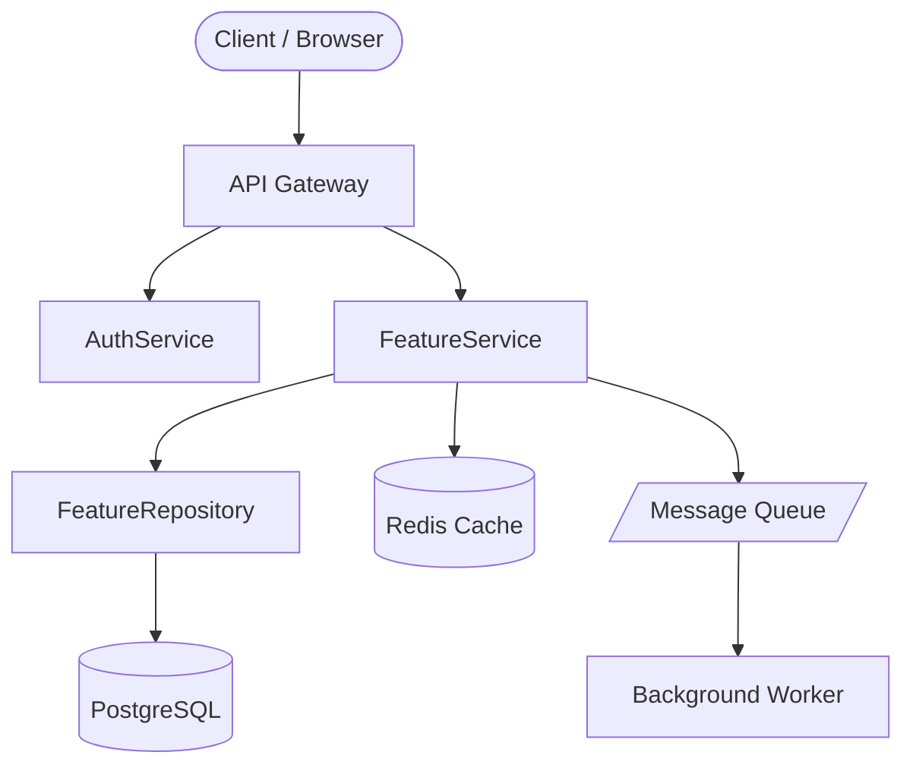
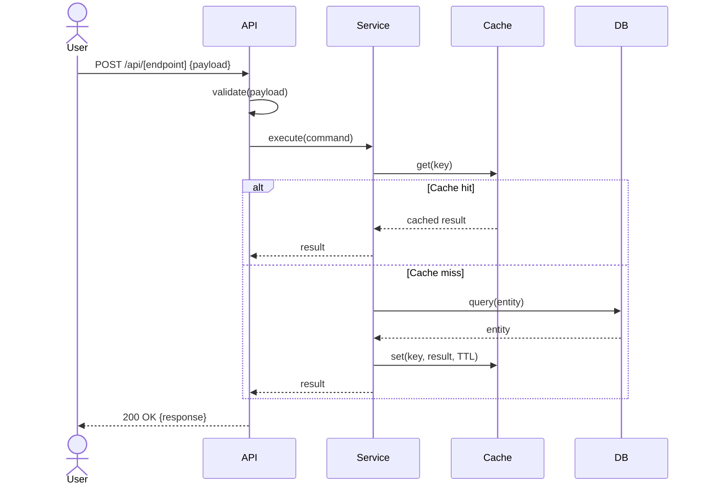
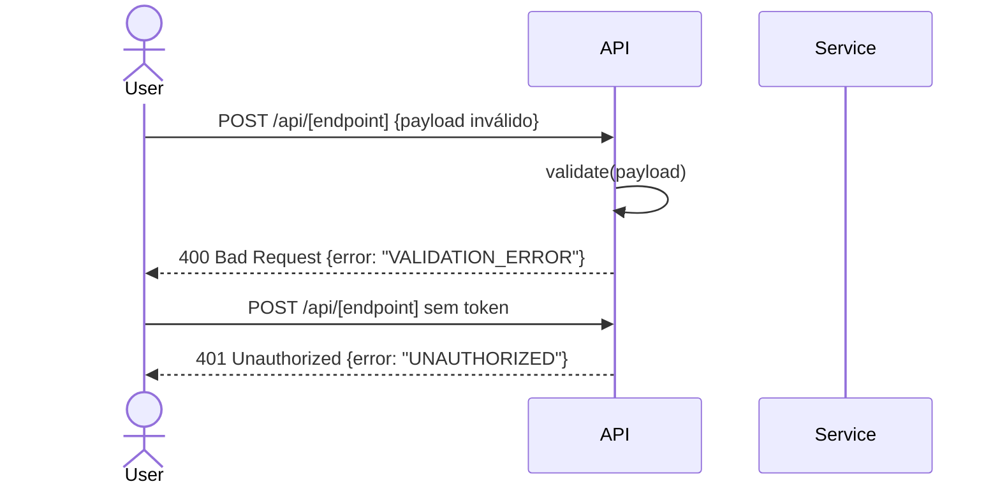
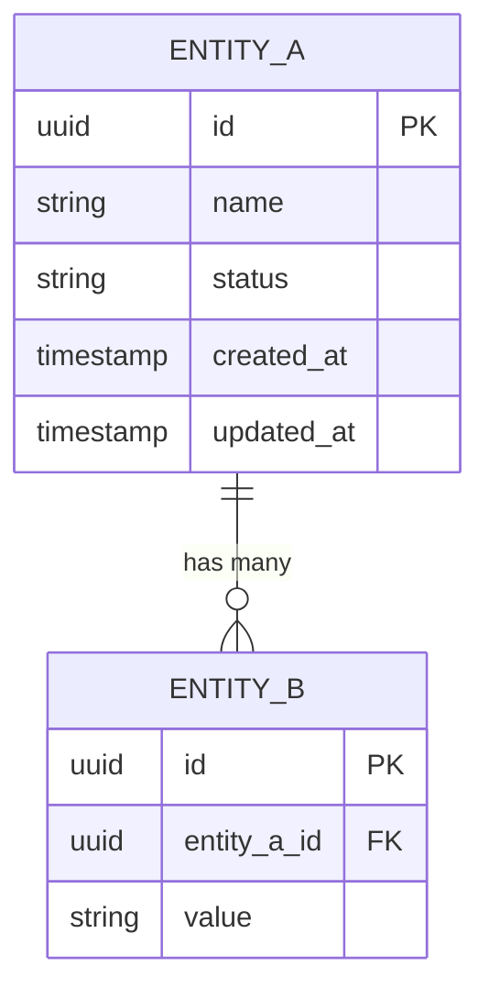
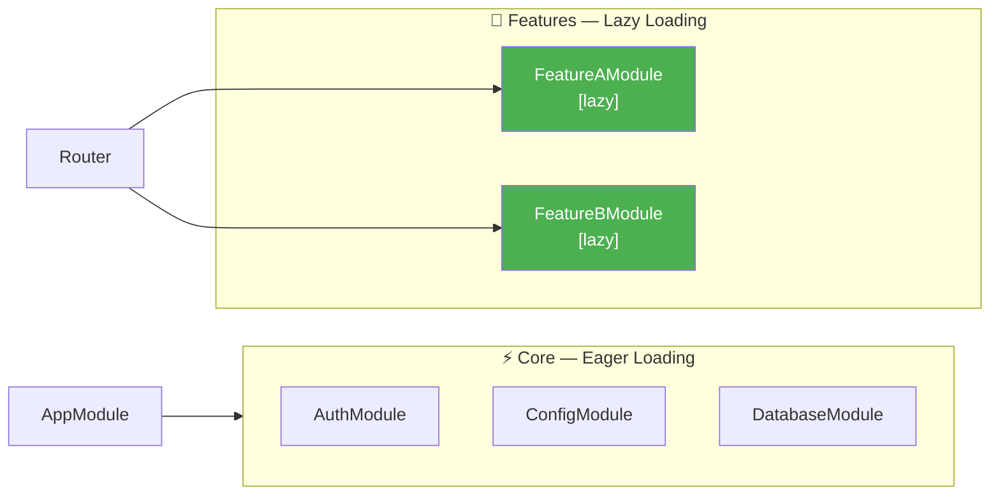

# Template: Design (Arquitetura e Contratos)

> Copie para `.sdd/specs/[feature-slug]/design.md`
> Owner: Arquiteto / Tech Lead da feature

---

# Design: [Feature Name]

**ID:** FEAT-[NNN]
**Data:** YYYY-MM-DD
**Status:** DRAFT | APPROVED

---

## Visão Arquitetural

> Diagrama de alto nível mostrando todos os componentes envolvidos.
> Inclua sistemas externos, bancos de dados, queues e caches.



---

## Fluxo Principal (Happy Path)



---

## Fluxos de Erro



---

## Modelo de Dados (quando há mudança de schema)



---

## Boundaries de Módulos e Lazy Loading (quando aplicável)



> Módulos com `[lazy]` são carregados somente quando a rota correspondente é acessada.

---

## Contratos de API

### [MÉTODO] /api/[endpoint]

**Auth:** Bearer Token (JWT) | Public | API Key
**Rate Limit:** [N] req/min por [usuário/IP]

**Request:**
```json
{
  "campo1": "string (obrigatório)",
  "campo2": "number (opcional, default: 0)"
}
```

**Response [STATUS]:**
```json
{
  "id": "uuid",
  "campo1": "string",
  "createdAt": "ISO 8601"
}
```

**Erros:**
| Status | Código de Erro | Quando ocorre |
|--------|---------------|---------------|
| 400 | `VALIDATION_ERROR` | Payload inválido |
| 401 | `UNAUTHORIZED` | Token ausente ou expirado |
| 403 | `FORBIDDEN` | Sem permissão para o recurso |
| 404 | `NOT_FOUND` | Recurso não existe |
| 409 | `CONFLICT` | Recurso duplicado |
| 429 | `RATE_LIMITED` | Limite de requisições excedido |
| 500 | `INTERNAL_ERROR` | Erro inesperado |

---

## Decisões de Design (ADR inline)

| Decisão | Alternativas consideradas | Justificativa |
|---------|--------------------------|---------------|
| [ex: Usar Redis para cache] | [Memcached, sem cache] | [TTL configurável, suporte a pub/sub] |
| [ex: Padrão Repository] | [Active Record, Query Builder] | [Testabilidade, separação de concerns] |
