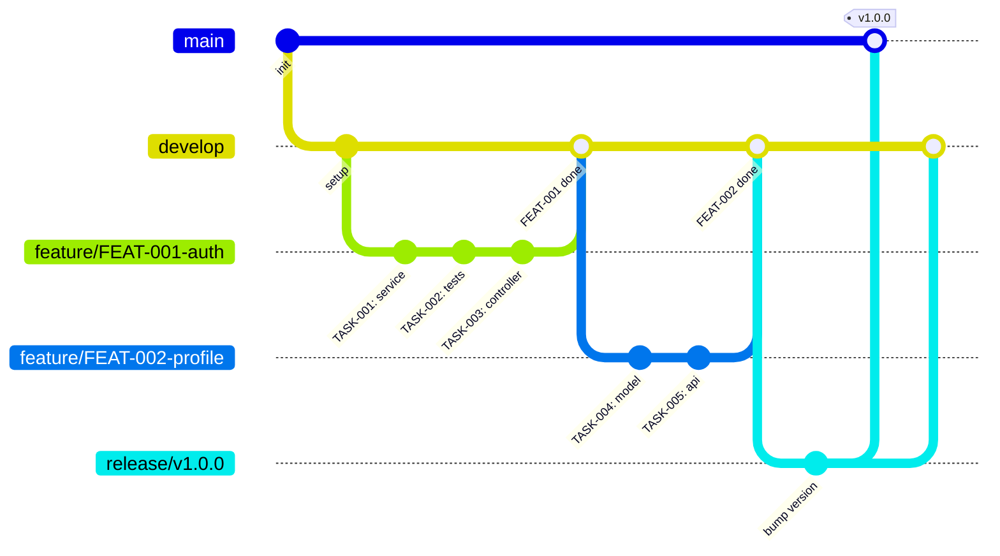

# GitFlow ↔ ng-sdd: Integração Completa

> **Owner:** Tech Lead / DevOps
> **Lido por:** `phases/00-init.md`, `phases/05-execute.md`, `phases/06-archive.md`

---

## Visão Geral

O GitFlow define **onde** o código existe. O ng-sdd define **o que** e **como** implementar.
Juntos, eliminam conflitos de merge, garantem rastreabilidade e mantêm branches limpas.



---

## Setup Inicial

```bash
# Instalar git-flow
brew install git-flow-avh   # macOS
apt-get install git-flow    # Debian/Ubuntu
choco install gitflow-avh   # Windows

# Inicializar no repositório (rode uma única vez)
git flow init

# Responda:
# Branch name for production releases: main
# Branch name for "next release": develop
# Feature branches prefix: feature/
# Bugfix branches prefix: bugfix/
# Release branches prefix: release/
# Hotfix branches prefix: hotfix/
# Support branches prefix: support/
# Version tag prefix: v

# Publicar develop no remoto
git push -u origin develop
```

---

## Mapeamento ng-sdd ↔ GitFlow

| ng-sdd Fase | Ação GitFlow | Branch |
|---|---|---|
| `/ngsdd:init` | `git flow init` | `main`, `develop` criadas |
| `/ngsdd:specify` (feature) | `git flow feature start FEAT-NNN-slug` | `feature/FEAT-NNN-slug` |
| `/ngsdd:execute` | commits na branch da feature | `feature/FEAT-NNN-slug` |
| `/ngsdd:archive` | `git flow feature finish FEAT-NNN-slug` | merge em `develop` |
| Quick Path (bug urgente) | `git flow hotfix start FEAT-NNN-slug` | `hotfix/FEAT-NNN-slug` |
| Archive de hotfix | `git flow hotfix finish FEAT-NNN-slug` | merge em `main` + `develop` + tag |
| Release | `git flow release start v1.2.0` | `release/v1.2.0` |
| Publicar release | `git flow release finish v1.2.0` | merge em `main` + `develop` + tag |

---

## Convenção de Nomes de Branch

```
feature/FEAT-001-user-authentication
feature/FEAT-002-payment-integration
bugfix/BUG-015-fix-email-validation
hotfix/HOT-003-critical-auth-bypass
release/v1.2.0
support/v1.x-legacy-support
```

**Regras:**
- Use o ID do spec (`FEAT-NNN`) para rastreabilidade
- Use kebab-case para o slug
- Nunca use espaços ou caracteres especiais
- O slug deve ser idêntico ao usado em `.sdd/specs/[slug]/`

---

## Fluxo Feature (Full Path)

```bash
# 1. SPECIFY — Criar branch da feature
git flow feature start FEAT-001-user-authentication

# 2. EXECUTE — Trabalhar na feature
git add src/modules/auth/auth.service.ts
git commit -m "feat(auth): add JWT token generation [TASK-001]"

git add tests/auth/auth.service.spec.ts
git commit -m "test(auth): add unit tests for token generation [TASK-002]"

# 3. Sincronização diária com develop (em features longas)
git fetch origin
git rebase origin/develop
git push origin feature/FEAT-001-user-authentication --force-with-lease

# 4. ARCHIVE — Finalizar a feature
git flow feature finish FEAT-001-user-authentication
# → merge automático em develop
# → delete da branch local

# 5. Publicar
git push origin develop
git push origin --delete feature/FEAT-001-user-authentication
```

---

## Fluxo Hotfix (Quick Path — Bug Crítico em Produção)

```bash
# 1. Iniciar hotfix a partir de main
git flow hotfix start HOT-003-critical-auth-bypass
# → cria branch hotfix/HOT-003-critical-auth-bypass a partir de main

# 2. EXECUTE — Implementar fix (Quick Path: sem RESEARCH, DESIGN, TASKS)
git add src/modules/auth/auth.guard.ts
git commit -m "fix(auth): prevent JWT bypass on expired tokens [HOT-003]"

git add tests/auth/auth.guard.spec.ts
git commit -m "test(auth): add regression test for bypass [HOT-003]"

# 3. ARCHIVE — Finalizar hotfix
git flow hotfix finish HOT-003-critical-auth-bypass
# → merge automático em main E develop
# → cria tag v[versão-atual+patch] automaticamente

# 4. Publicar
git push origin main
git push origin develop
git push origin --tags
```

---

## Fluxo Release

```bash
# Após N features mergeadas em develop, criar release
git flow release start v1.2.0
# → cria branch release/v1.2.0 a partir de develop

# Ajustes finais de release (changelog, bump de versão, hotfixes menores)
git commit -m "chore(release): bump version to v1.2.0"
git commit -m "docs: update CHANGELOG for v1.2.0"

# Finalizar release
git flow release finish v1.2.0
# → merge em main (com tag v1.2.0)
# → merge em develop
# → delete da branch release

# Publicar tudo
git push origin main
git push origin develop
git push origin --tags
```

---

## Proteção de Branches

Configure no seu repositório (GitHub/GitLab/Bitbucket):

| Branch | Proteção |
|---|---|
| `main` | Require PR + 2 approvals + CI passing + no direct push |
| `develop` | Require PR + 1 approval + CI passing |
| `feature/*` | Sem proteção (developer pode force-push) |
| `hotfix/*` | Sem proteção (developer pode force-push) |
| `release/*` | Require PR + Tech Lead approval |

---

## Resolução de Conflitos

```bash
# Durante rebase com develop
git fetch origin
git rebase origin/develop

# Se houver conflito:
# 1. Abra os arquivos com conflito e resolva manualmente
# 2. git add [arquivo-resolvido]
# 3. git rebase --continue

# Se o conflito for muito complexo:
git rebase --abort
# Discuta com o time antes de tentar novamente
```

> **Prevenção:** Faça rebase com `develop` diariamente em features longas.
> Features longas (> 3 dias) devem ser quebradas em features menores.

---

## Troubleshooting

| Problema | Solução |
|---|---|
| `fatal: Not a gitflow-enabled repo` | Rode `git flow init` |
| Conflito ao fazer `feature finish` | Faça rebase com develop antes de finalizar |
| Branch deletada por acidente | `git checkout -b feature/FEAT-NNN-slug origin/feature/FEAT-NNN-slug` |
| Tag criada no lugar errado | `git tag -d v1.2.0 && git push origin --delete v1.2.0` e refaça |
| CI falhando na feature branch | Rode `npm test && npm run lint` localmente antes de push |
