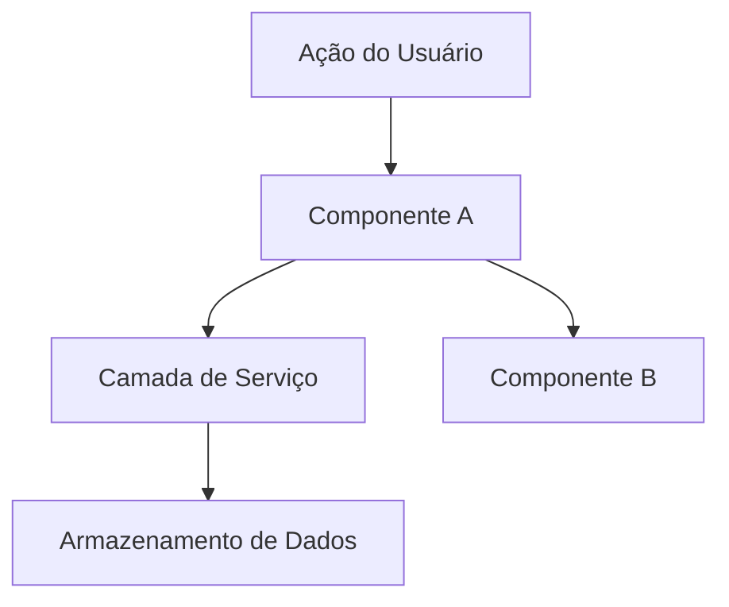

# Design

**Objetivo**: Definir COMO construir. Arquitetura, componentes, o que reaproveitar.

**Pule esta fase quando:** A alteração for direta — sem decisões de arquitetura, sem novos padrões, sem interações de componentes para planejar. Para funcionalidades simples, o design ocorre inline durante a Execução.

## Processo

### 1. Carregar Contexto

Leia `.specs/features/[feature]/spec.md` antes de projetar. Se `.specs/features/[feature]/context.md` existir, carregue-o também — ele contém decisões de implementação que limitam o design (escolhas de layout, preferências de comportamento, padrões de interação). As decisões marcadas como "Discricionário do Agente" (Agent's Discretion) ficam a seu critério decidir.

### 1.5. Pesquisa (Opcional, mas Recomendada)

Se a funcionalidade envolver tecnologia, padrões ou integrações desconhecidas, pesquise antes de projetar. Documente as descobertas brevemente no documento de design ou como notas inline. Isso evita que suposições incorretas se propaguem para as tarefas.

Siga a **Cadeia de Verificação de Conhecimento** (ver SKILL.md) em ordem estrita:

```
Base de código → Docs do projeto → MCP Context7 → Busca na web → Sinalizar incerteza
```

**CRÍTICO: NUNCA assuma ou invente informações.** Se você não conseguir encontrar uma resposta através da cadeia, diga explicitamente "Não sei" ou "Não consegui encontrar documentação para isso". Inventar uma API, um padrão ou um comportamento que não existe é muito pior do que admitir incerteza. Suposições erradas se propagam pelo design → tarefas → implementação e causam falhas em cascata.

Bons gatilhos para pesquisa: novas bibliotecas, APIs desconhecidas, funcionalidades sensíveis ao desempenho, funcionalidades sensíveis à segurança, padrões que você não usou nesta base de código antes.

### 2. Definir Arquitetura

Visão geral de como os componentes interagem. Use diagramas mermaid quando útil. Antes de criar qualquer diagrama, verifique se a skill `mermaid-studio` está disponível (ver Integração com Outras Skills no SKILL.md).

### 3. Identificar Reuso de Código

**CRÍTICO**: Que código existente podemos alavancar? Isso economiza tokens e reduz erros.

Se `.specs/codebase/CONCERNS.md` existir, verifique-o antes de projetar. Qualquer componente sinalizado como frágil, carregando débito técnico ou com lacunas de cobertura de testes exige cuidados extras no design — documente como o design mitiga essas preocupações.

### 4. Definir Componentes e Interfaces

Cada componente: Propósito, Localização, Interfaces, Dependências, O que reaproveita.

### 5. Definir Modelos de Dados

Se a funcionalidade envolver dados, defina os modelos antes da implementação.

---

## Template: `.specs/[feature]/design.md`

```markdown
# Design de [Funcionalidade]

**Especificação**: `.specs/[feature]/spec.md`
**Status**: Rascunho | Aprovado

---

## Visão Geral da Arquitetura

[Breve descrição da abordagem de arquitetura]



---

## Análise de Reuso de Código

### Componentes Existentes para Alavancar

| Componente | Localização | Como Usar |
| :--- | :--- | :--- |
| [Componente Existente] | `src/caminho/do/arquivo` | [Estender/Importar/Referenciar] |
| [Utilitário Existente] | `src/utils/arquivo` | [Como ele ajuda] |
| [Padrão Existente] | `src/padroes/arquivo` | [Aplicar o mesmo padrão] |

### Pontos de Integração

| Sistema | Método de Integração |
| :--- | :--- |
| [API Existente] | [Como a nova funcionalidade se conecta] |
| [Banco de Dados] | [Como os dados se conectam aos schemas existentes] |

---

## Componentes

### [Nome do Componente]

- **Propósito**: [O que este componente faz - uma frase]
- **Localização**: `src/caminho/para/o/componente/`
- **Interfaces**:
  - `nomeDoMetodo(param: Tipo): TipoRetorno` - [descrição]
  - `nomeDoMetodo(param: Tipo): TipoRetorno` - [descrição]
- **Dependências**: [O que ele precisa para funcionar]
- **Reaproveita**: [Código existente sobre o qual este componente se baseia]

### [Nome do Componente]

- **Propósito**: [O que este componente faz]
- **Localização**: `src/caminho/para/o/componente/`
- **Interfaces**:
  - `nomeDoMetodo(param: Tipo): TipoRetorno`
- **Dependências**: [Dependências]
- **Reaproveita**: [Código existente]

---

## Modelos de Dados (se aplicável)

### [Nome do Modelo]

```typescript
interface NomeDoModelo {
  id: string
  campo1: string
  campo2: number
  createdAt: Date
}
```

**Relacionamentos**: [Como este se relaciona com outros modelos]

### [Nome do Modelo]

```typescript
interface OutroModelo {
  id: string
  // ...
}
```

---

## Estratégia de Tratamento de Erros

| Cenário de Erro | Tratamento | Impacto no Usuário |
| :--- | :--- | :--- |
| [Cenário 1] | [Como é tratado] | [O que o usuário vê] |
| [Cenário 2] | [Como é tratado] | [O que o usuário vê] |

---

## Decisões Técnicas (apenas as não óbvias)

| Decisão | Escolha | Justificativa |
| :--- | :--- | :--- |
| [O que decidimos] | [O que escolhemos] | [Por que - breve] |

---

## Dicas

- **Carregue o contexto primeiro** — Se o `context.md` existir, as decisões ali contidas estão consolidadas e travadas
- **Pesquise quando estiver incerto** — 5 minutos de pesquisa evitam horas de retrabalho
- **Reuso é rei** — Cada componente deve fazer referência a padrões existentes
- **Interfaces primeiro** — Defina contratos antes da implementação
- **Mantenha visual** — Diagramas economizam 1000 palavras (verifique a skill `mermaid-studio` na Integração de Skills)
- **Componentes pequenos** — Se um componente faz 3 ou mais coisas, divida-o
- **Verifique o CONCERNS.md** — Se existir, mapeie áreas frágeis que o design deve abordar
- **Confirme antes das Tarefas** — O usuário deve aprovar o design antes de detalhá-lo em tarefas
