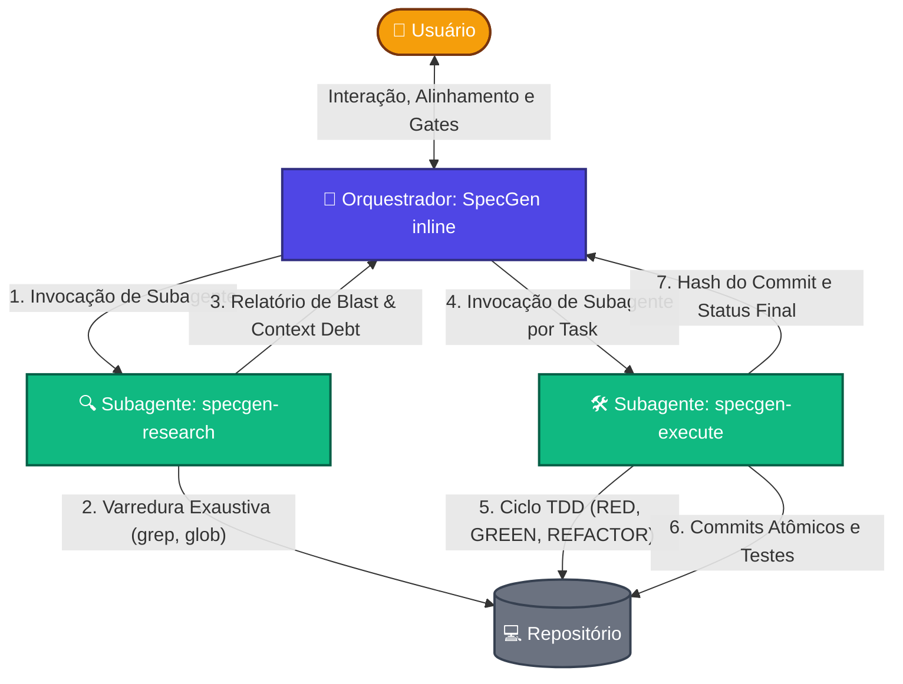

# Next Gen Spec-Driven Development (SpecGen) v2.2

**SpecGen v2.2** é um framework enterprise de Spec-Driven Development para Agentes de Inteligência Artificial. Projetado para grandes equipes, projetos complexos e fluxos Greenfield/Brownfield, ele utiliza uma **Arquitetura Modular** com Lazy Loading de contexto e um pipeline de **Fases Gated** para eliminar alucinações, *scope creep* e conflitos de código.

## 🚀 Como Funciona (Pipeline Gated e Orquestração)

Ao contrário de frameworks monolíticos, o SpecGen v2.2 é dividido em múltiplos arquivos que são carregados via **Lazy Loading** pelo agente, poupando tokens e mantendo o contexto limpo. Além disso, ele age como um **Orquestrador**, separando tarefas de interação humana das tarefas pesadas delegadas para **Subagentes**.

O pipeline possui 7 fases acionadas via Custom Commands:

*   `/specgen:init` — **Fundação:** Detecta Greenfield vs Brownfield, estrutura o PRD, cria o `CONSTITUTION.md` e inicializa o repositório.
*   `/specgen:research` — **Elicitação e Contexto (Delegado):** Identifica context debt, blast radius e contratos implícitos com questionamento socrático, *delegando a varredura pesada de código para o subagente `specgen-research`*.
*   `/specgen:specify` — **Source of Truth:** Cria a especificação com User Stories, BDD, RFs e RNFs.
*   `/specgen:design` — **Arquitetura e Contratos:** Usa Mermaid obrigatório (arquitetura, sequência, ER, lazy loading boundaries) e define o contrato de mudança no `delta.md`.
*   `/specgen:tasks` — **Decomposição:** Quebra em tarefas atômicas (2-5 min), organizadas em grupos PARALELOS e SEQUENCIAIS com matriz de sub-agentes.
*   `/specgen:execute` — **Implementação Cirúrgica (Delegado):** Força TDD estrito e commits atômicos, *delegando a execução de cada task para o subagente `specgen-execute`*, enquanto o orquestrador acompanha o progresso.
*   `/specgen:archive` — **Quality Gate:** Executa validação final contra a spec e o delta e higieniza o workspace.

## 🤝 Modelo de Orquestração e Subagentes

Para otimizar o uso do contexto e manter a conversa principal limpa de logs de execução e comandos repetitivos de busca, o **SpecGen v2.2** separa o fluxo em papéis:

1. **Orquestrador Principal (Inline):** Executado diretamente na janela de chat com o usuário. É o "Cérebro" do projeto, responsável por alinhar expectativas com o usuário, obter aprovações nos Gates (PRD, Spec, Design) e definir a estratégia.
2. **Subagentes Operacionais (Background Workers):** Executados de forma autocontida e assíncrona. Recebem tarefas específicas e detalhadas, executam-nas no repositório e devolvem apenas o relatório final para o Orquestrador.

### Fluxograma de Orquestração (Flowchart)

## ⚡ Modo Adaptativo

A skill detecta a complexidade da tarefa no início e seleciona o melhor caminho, evitando burocracia desnecessária:

*   **Full Path:** Para features complexas (> 3 arquivos, novas integrações). Executa as 7 fases completas.
*   **Quick Path:** Para hotfixes e tarefas simples (≤ 3 arquivos). Pula Research, Design e Tasks, indo direto para `INIT → SPECIFY → EXECUTE → ARCHIVE`.

## 🗂️ Arquitetura Modular (Zero Conflitos)

Para evitar conflitos de merge em times grandes, a skill foi fragmentada:

*   `SKILL.md`: Entry point roteador magro (< 80 linhas).
*   `phases/`: 7 arquivos independentes (ownership isolado por papel).
*   `templates/`: Modelos prontos para o agente copiar (PRD, spec, design, delta, tasks, quality-gate).

## 🤖 Compatibilidade

A definição agnóstica do **SpecGen** permite sua execução transparente nos principais orquestradores e IDEs focados em IA:

*   **Antigravity (Gemini):** Invocação natural no terminal. Sub-agentes são orquestrados nativamente.
*   **Devin / Windsurf / Cursor:** Anexar a estrutura na configuração de regras (`.cursorrules` ou similar) mapeando o entry point para o `SKILL.md`.
*   **Claude Code:** Inclua o `SKILL.md` como contexto inicial para que o roteamento dinâmico guie a execução.
