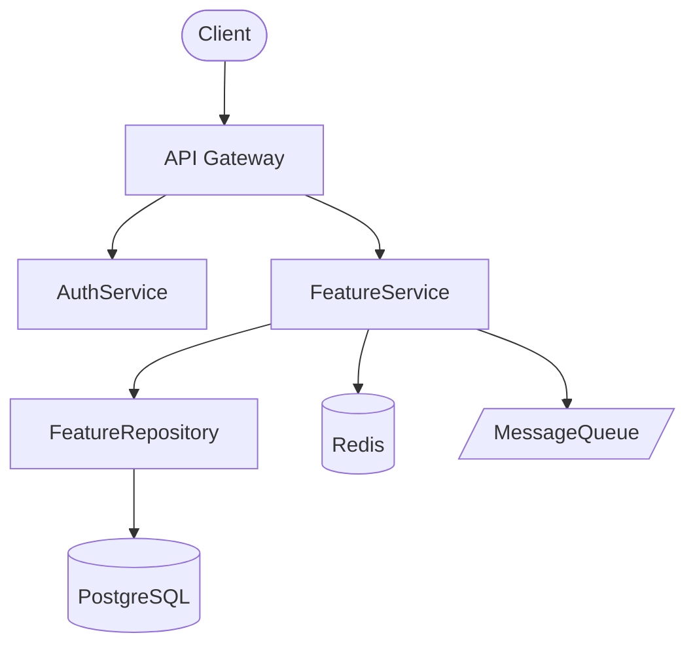
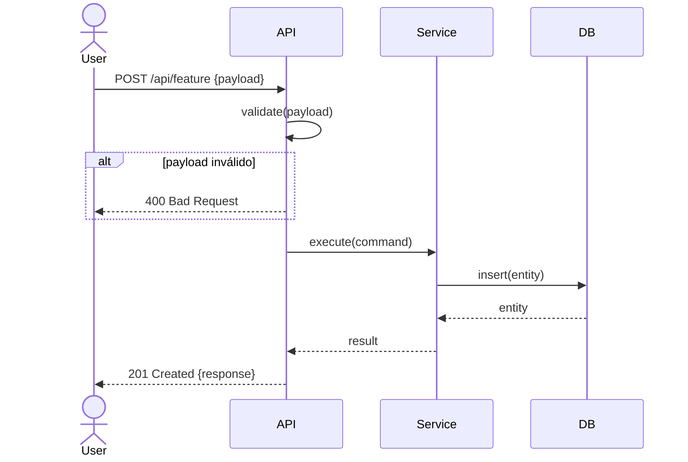
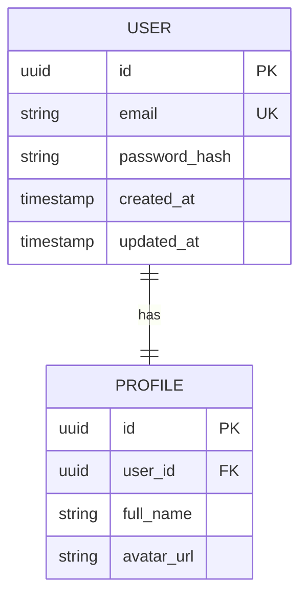
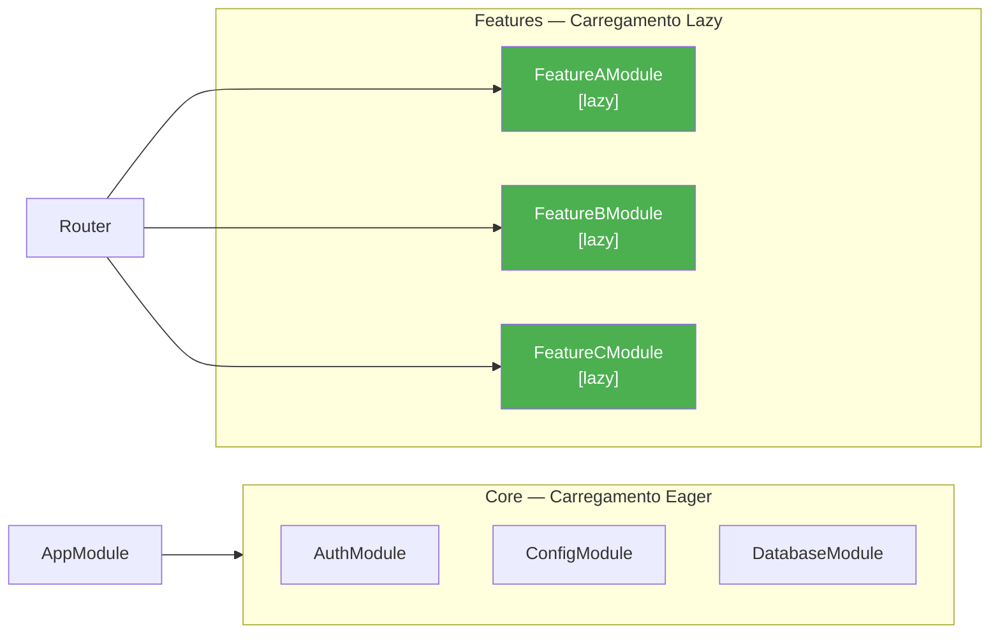

# Fase 3 — DESIGN: Arquitetura e Contratos

> **Owner:** Tech Lead / Arquiteto de Software
> **Comando:** `/specgen:design`
> **Opcional no Quick Path** — Obrigatória no Full Path.

---

## Objetivo

Traduzir a spec aprovada em uma arquitetura visual e contratos de API verificáveis.
Nenhum detalhe de implementação é decidido na execução — tudo é decidido aqui.

---

## Passo 1 — Criar design.md

Copie `templates/design.md` para `.sdd/specs/[feature-slug]/design.md`.

### Diagrama de Arquitetura (obrigatório)

Use `flowchart` para visão de alto nível (estilo C4 simplificado):



> Inclua todos os sistemas externos, bancos, queues e caches que a feature toca.

### Diagrama de Sequência (obrigatório — fluxo principal)



> Adicione `alt` para cada edge case da spec. Um diagrama por fluxo relevante.

### Diagrama de Dados / ER (quando há mudança de schema)



### Diagrama de Módulos e Lazy Loading (quando há mudança arquitetural)

Identifique explicitamente módulos eager (carregados na inicialização) vs lazy (carregados sob demanda):



---

## Passo 2 — Criar delta.md (Contrato de Mudança)

Copie `templates/delta.md` para `.sdd/specs/[feature-slug]/delta.md`.

O delta.md lista **todos** os arquivos que serão criados, modificados ou removidos.
É o único contrato válido — qualquer arquivo fora dele é scope creep.

```markdown
## ADDED (Novos arquivos)
- [ ] `src/modules/feature-x/feature-x.module.ts`
- [ ] `src/modules/feature-x/feature-x.service.ts`
- [ ] `src/modules/feature-x/feature-x.controller.ts`
- [ ] `src/modules/feature-x/dto/create-feature-x.dto.ts`
- [ ] `tests/feature-x/feature-x.service.spec.ts`

## MODIFIED (Arquivos alterados)
- [ ] `src/app.module.ts` — importar FeatureXModule
- [ ] `src/routes/index.ts` — registrar /feature-x

## REMOVED (Arquivos removidos)
- [ ] `src/legacy/old-feature.ts` — substituído pelo novo módulo

## Migrations (quando há mudança de schema)
- [ ] `migrations/YYYYMMDDHHMMSS-create-feature-x-table.ts`
```

---

## Passo 3 — Contratos de API

Para cada endpoint novo ou modificado:

```markdown
### POST /api/feature-x

**Auth:** Bearer Token (JWT)
**Rate limit:** 100 req/min por usuário

**Request:**
```json
{
  "name": "string (obrigatório, max 100 chars)",
  "value": "number (obrigatório, > 0)"
}
```

**Response 201 Created:**
```json
{
  "id": "uuid",
  "name": "string",
  "value": "number",
  "createdAt": "ISO 8601"
}
```

**Erros:**
| Status | Código | Quando |
|--------|--------|--------|
| 400 | VALIDATION_ERROR | Payload inválido |
| 401 | UNAUTHORIZED | Token ausente ou inválido |
| 409 | ALREADY_EXISTS | Recurso duplicado |
| 500 | INTERNAL_ERROR | Erro inesperado |
```

---

## Passo 4 — Gate de Aprovação ✋

> Apresente `design.md` e `delta.md` ao usuário.
> **Não avance sem aprovação explícita dos dois documentos.**
>
> Checklist:
> - [ ] Diagrama de arquitetura cobre todos os sistemas?
> - [ ] Diagrama de sequência tem o happy path e os edge cases?
> - [ ] Delta.md lista todos os arquivos a criar/modificar/remover?
> - [ ] Contratos de API têm request, response e erros documentados?
> - [ ] Módulos lazy loading estão identificados (se aplicável)?
>
> Após aprovação, atualize `.sdd/specs/[feature-slug]/spec.md` status para `DESIGNING_DONE`.
